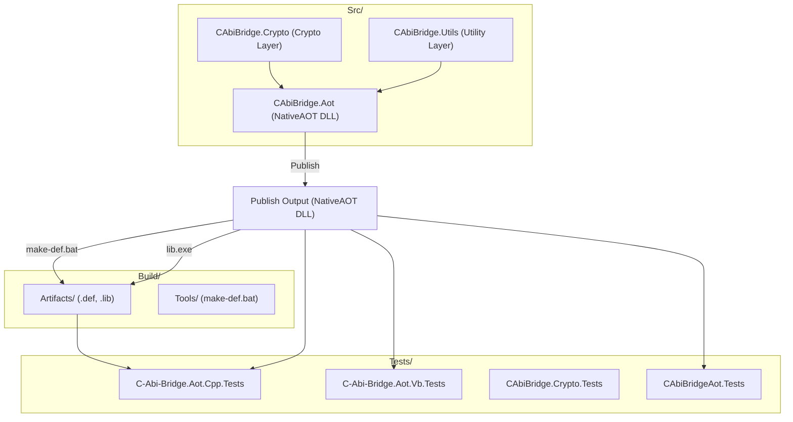

# 📘 Architecture Diagram  

This document provides a high‑level overview of the internal structure of the **C‑Abi‑Bridge‑Aot** project.

---

# 1. Mermaid Diagram (GitHub‑compatible)



--- 

# 2. ASCII Diagram (for README or plain text)

```
C-Abi-Bridge-Aot
│
├── Build/
│   ├── Artifacts/        # Generated .def and .lib files
│   └── Tools/            # make-def.bat and helper scripts
│
├── Src/
│   ├── CAbiBridge.Aot    # NativeAOT project (exports C ABI)
│   ├── CAbiBridge.Crypto # Cryptographic implementation
│   └── CAbiBridge.Utils  # Utility helpers
│
├── Tests/
│   ├── C-Abi-Bridge.Aot.Cpp.Tests  # C++ ABI tests (uses .lib + DLL)
│   ├── C-Abi-Bridge.Aot.Vb.Tests   # VB.NET P/Invoke tests
│   ├── CAbiBridge.Crypto.Tests     # Managed crypto tests
│   └── CAbiBridgeAot.Tests         # Managed AOT tests
│
└── Publish Output (NativeAOT DLL)
     │
     ├── make-def.bat  →  C-Abi-Bridge.Aot.def
     ├── lib.exe       →  C-Abi-Bridge.Aot.lib
     └── Artifacts/    →  Stored for C++ consumers
```

--- 

# 3. Explanation

- **CAbiBridge.Aot** - The NativeAOT project that exposes the C ABI and compiles into a single‑file DLL.
- **CAbiBridge.Crypto** - Implements AES, GCM, ChaCha20‑Poly1305, hashing, HMAC, PQC, etc.
- **CAbiBridge.Utils** - Provides helper utilities, memory handling, encoding, etc.
- **Build/Tools** - Contains make-def.bat, used to extract exported symbols.
- **Build/Artifacts** - Stores the generated .def and .lib files for C++ consumers.
- **Tests** - Validate ABI stability, cryptographic correctness, and interop behavior.

---


