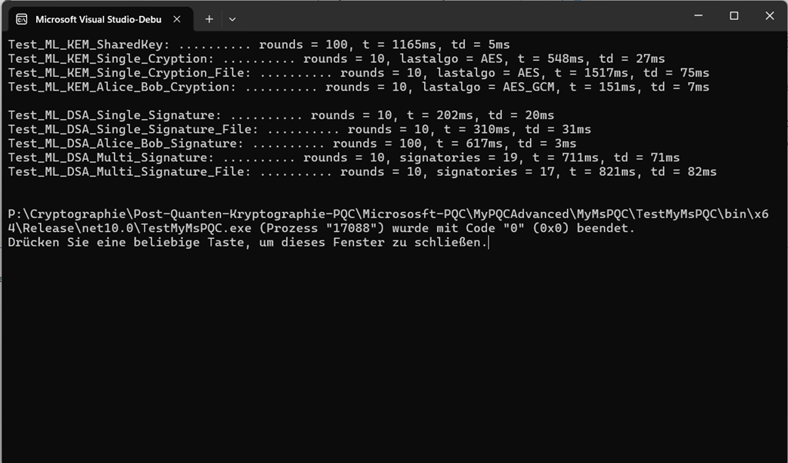

# MyMsPQC – Post‑Quantum Cryptography for .NET

MyMsPQC is a lightweight .NET project demonstrating how to use [Microsoft’s Post‑Quantum Cryptography (PQC)](https://devblogs.microsoft.com/dotnet/post-quantum-cryptography-in-dotnet/) implementations. It provides simple, practical examples for integrating quantum‑resistant algorithms into modern .NET applications.

___

## ✨ Features

Integration of Microsoft PQC algorithms

Examples for:
- Key generation
- Key Encapsulation Mechanism (KEM): encapsulation & decapsulation
- Digital signatures: signing & verification
- Clean project structure with a dedicated test project
- Ideal as a learning resource or integration reference for PQC in .NET

---

## 📁 Project Structure

```
MyMsPQC/
│
├── MyMsPQC /           # Core library with PQC implementations
├── TestMyMsPQC /       # Unit tests and usage examples
├── TestMyMsPQCVb /     # Unit tests and usage examples in Vb.Net
└── TestMyMsPQC.slnx    # Solution file
```

---

## 🧰 Requirements

- .NET 8 or later
- Windows, Linux, or macOS
- Optional: Visual Studio, Rider, or VS Code

---

## 🔐 Post‑Quantum Algorithms Overview

This project demonstrates Microsoft’s implementations of the first NIST‑standardized post‑quantum algorithms. These algorithms were selected after a multi‑year global competition and are now published as official FIPS standards.

Below is an overview of each algorithm family, their origins, performance characteristics, and current availability in .NET.

...

### 📘 ML‑KEM (formerly CRYSTALS‑Kyber) — FIPS 203

Type: Key Encapsulation Mechanism (KEM)
Use cases: Key exchange, hybrid TLS, encrypted messaging
Status: Standardized by NIST in 2024 as FIPS 203

#### 🔎 Background

ML‑KEM originates from CRYSTALS‑Kyber, a lattice‑based KEM built on the hardness of module‑LWE. It was selected for its strong security proofs, excellent performance, and resistance to known quantum attacks.

#### ⚙️ Performance Characteristics

- Very fast key generation and encapsulation
- Small ciphertext and key sizes
- Efficient on constrained devices
- Well‑suited for high‑volume protocols like TLS 1.3

ML‑KEM is widely considered the default PQC KEM for the coming decades.

#### 🔮 Future Outlook
ML‑KEM is expected to become the global standard for PQ key exchange.
NIST recommends maintaining cryptographic agility to adapt to future developments.

...

### 📙 ML‑DSA (formerly CRYSTALS‑Dilithium) — FIPS 204

Type: Digital Signature Algorithm
Use cases: Code signing, certificates, authentication
Status: Standardized by NIST in 2024 as FIPS 204

#### 🔎 Background

ML‑DSA is derived from CRYSTALS‑Dilithium, a lattice‑based signature scheme using module‑LWE and module‑SIS assumptions. It offers a strong balance of security, performance, and signature size.

#### ⚙️ Performance Characteristics

- Very fast signature verification
- Practical signature sizes
- Suitable for certificate chains and high‑volume verification workloads

#### 🔮 Future Outlook

ML‑DSA is expected to replace ECDSA/Ed25519 in many ecosystems.
It is already being integrated into TLS, SSH, and major operating systems.

...

### 📗 SLH‑DSA (formerly SPHINCS+) — FIPS 205

Type: Stateless hash‑based signature scheme
Use cases: Long‑term archival signatures, high‑assurance systems
Status: Standardized by NIST in 2024 as FIPS 205

#### 🔎 Background

SLH‑DSA is based on SPHINCS+, a stateless hash‑based signature scheme.
Its security relies solely on the strength of hash functions, making it extremely conservative and robust.

#### ⚠️ Availability in .NET

At the moment, SLH‑DSA is not yet available in Microsoft’s PQC .NET libraries.
Therefore, this project does not include SLH‑DSA examples.

#### ⚙️ Performance Characteristics
- Very large signatures (tens of kilobytes)
- Slower signing operations
- Extremely strong and conservative security assumptions
- Ideal for long‑term digital archives

#### 🔮 Future Outlook

SLH‑DSA will remain a niche but essential algorithm for high‑assurance environments.

...

### 🧩 Algorithm Comparison

| Algorithm | Origin | FIPS Standard | Type | Strengths | Weaknesses |
|----------|--------|---------------|------|-----------|------------|
| **ML‑KEM** | CRYSTALS‑Kyber | FIPS 203 | KEM | Fast, small keys, ideal for TLS | Lattice‑based assumptions |
| **ML‑DSA** | CRYSTALS‑Dilithium | FIPS 204 | Signature | Fast verification, practical sizes | Larger than classical signatures |
| **SLH‑DSA** | SPHINCS+ | FIPS 205 | Signature | Extremely conservative, hash‑based | Very large signatures, slower |

---

## 🚀 Getting Started

*Clone the repository:*
```
git clone https://github.com/michelenatale/Cryptography.git
cd Cryptography/PQC/DotNetCore/MyMsPQC
```

*Build the project:*
```
dotnet build
```

*Run the tests:*
```
dotnet test
```

---

## 🧪 Usage

The project demonstrates typical PQC workflows such as:
- Generating a quantum‑safe keypair
- Deriving a shared secret using a KEM
- Using the shared secret for symmetric encryption
- Creating and verifying digital signatures

All examples can be found in the TestMyMsPQC project.

---

## 🎯 Purpose

This project serves as a practical reference for developers who want to:
- Explore PQC algorithms in .NET
- Understand Microsoft’s PQCrypto implementations
- Build quantum‑resistant applications

---

## 📘 Documentation

A more detailed Crypto FAQ can be found here:

➡️ [PQC-Crypto FAQ](Docs/faq.md)

---

## 📄 License

This project is part of the broader Cryptography repository and follows its licensing terms.

---

## 🧭 Reference

[Microsoft Security Community Blog](https://techcommunity.microsoft.com/blog/microsoft-security-blog/microsofts-quantum-resistant-cryptography-is-here/4238780)

[PQC - A New Age of Digital Security](https://techcommunity.microsoft.com/blog/microsoft-security-blog/post-quantum-cryptography-comes-to-windows-insiders-and-linux/4413803)

[Post-Quantum-Kryptografie (PQC)](https://learn.microsoft.com/de-de/dotnet/core/whats-new/dotnet-10/libraries#post-quantum-cryptography-pqc)

---

## ▶️ Console Output



---
